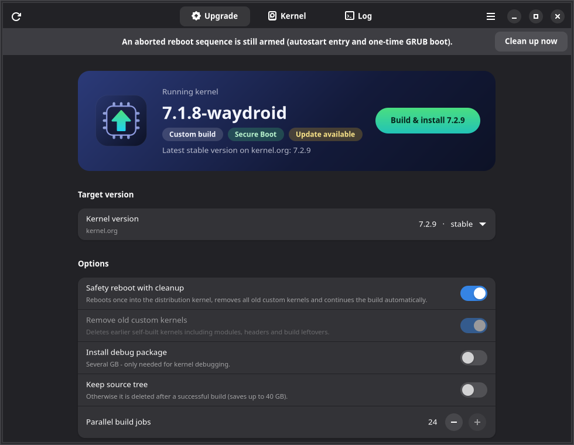

<p align="center"></p>

# Kernel Upgrade (v4.1)

[🇩🇪 Wechseln zur deutschen Version](README_DE.md)

A fully automated bash script with a graphical front end to compile, install, and sign current mainline Linux kernels. It integrates the kernel features Waydroid needs, cleans up old kernel remnants, and takes care of UEFI Secure Boot signing.



## 🚀 Features

- **🖥️ Graphical interface (`kernel_upgrade_gui`):** GTK4/libadwaita app with version selection from kernel.org, system status (Secure Boot, MOK, autosign), kernel management and a live log with progress. Password prompts (sudo, MOK) appear right inside the app.

- **🌐 OTA Auto-Updater:** Checks the GitHub repository on every start. A newer version is downloaded, validated, swapped in atomically, and your command resumes instantly. It never downgrades to an older version.

- **📦 Global Integration (`--install-system`):** Installs script and GUI to `~/.scripts`, configures your `~/.bashrc` PATH, adds an application menu entry with icon, and activates tab completion.

- **Fully Automated:** Downloads the requested kernel from `kernel.org` (stable, longterm, mainline or a fixed version), verifies the SHA256 checksum, configures, builds, and installs it.

- **Waydroid Ready:** Automatically merges a `.config` fragment for **Binder/BinderFS** and **NTSYNC**. Drop your own fragment at `~/.config/kernel_upgrade/config-fragment` to override it.

- **Secure Boot & DKMS Support:** Automated MOK (Machine Owner Key) generation, enrollment check, and signing of kernel images (`sbsign`). Keys are deployed as PEM and DER to `/var/lib/shim-signed/mok/`, so DKMS modules (e.g., DisplayLink `evdi`) get signed too.

- **🔄 Smart Version Validation:** Detects if the target kernel is already running or installed and offers alternatives. Packages that were already built are reused instead of recompiled.

- **🧹 Thorough Cleanup (`--purge-custom`, `--cleanup`):** Custom kernels are identified reliably by package origin, not by name. Removes packages, modules, headers, debug symbols, orphaned directories and old build leftovers. Distribution kernels are never touched.

- **🔁 Safety Reboot:** If a custom kernel is running, the system reboots once via `grub-reboot` into the distribution kernel, cleans up, and resumes the build automatically after login (in a terminal or in the GUI). Aborting the countdown reverts everything. Use `--no-reboot` to skip the reboot.

- **Autosign Integration:** Installs a post-install hook that automatically signs future kernels.

- **Multilingual:** Automatically detects system locale (English/German).

## 🛠 Prerequisites

- A Debian-based system (Ubuntu, Linux Mint, Debian, …) using GRUB
- Internet connection and root privileges (via `sudo`) – do **not** start the script itself with `sudo`
- About 45 GB of free disk space for the build
- For the GUI: GTK 4 and libadwaita ≥ 1.5 (Ubuntu 24.04, Linux Mint 22, Debian 13 or newer)

Build dependencies are installed automatically via `apt`.

## 📦 Installation & Usage

```bash
git clone -b waydroid https://github.com/SoulInfernoDE/compile-kernel-from-source.git
```

```bash
cd compile-kernel-from-source && chmod +x kernel_upgrade kernel_upgrade_gui && ./kernel_upgrade --install-system && source ~/.bashrc
```

From now on `kernel_upgrade` is available in every terminal with tab completion, and the GUI shows up as **Kernel Upgrade** in your application menu.

## ⚙️ Parameters & Options

```
Build
--kernelversion VER     Force a version (e.g. 6.12.1) or a channel: stable | longterm | mainline
--jobs N                Number of parallel build jobs (default: all cores)
--no-reboot             No safety reboot; build from the running custom kernel
--purge-custom          Deletes old custom kernels including leftovers
--with-dbg              Also install the (large) debug package
--keep-source           Keep the source tree after a successful build
-y, --yes               Answer all prompts with their default
--no-autosign           Do not install the autosign hook
--dry-run               Only show what would happen

Manage
--list                  Show installed kernels and available versions
--remove VER            Remove a single custom kernel
--cleanup               Only clean up, no build
--signonly [VER]        Only sign an existing kernel in /boot
--installautosign       Install/update the autosign hook
--uninstallautosign     Remove the autosign hook and optionally the keys
--install-system        Install script, GUI and icon
--update / --no-update  Only check for an update / skip the update check
--version, -h, --help   Show version or help
```

Environment variables: `KU_BUILD_DIR` (build directory), `KU_LOCALVERSION` (suffix, default `-waydroid`), `KU_NO_UPDATE=1`, `KU_NET_WAIT` (seconds to wait for the network, default 60).

## 🔐 Secure Boot Note

On the first run the script offers to generate new MOK keys and asks for a one-time password.

1. Reboot your system after the script finishes.
2. In the blue MOK Manager select: Enroll MOK → Continue → Yes → Enter Password → Reboot.

The new kernel can now be booted securely.

## 📂 File Structure

| Path | Purpose |
| --- | --- |
| `~/.scripts/` | Installation path of `kernel_upgrade` and `kernel_upgrade_gui` |
| `~/Downloads/kernel_upgrade/` | Build directory: sources, build log and finished `.deb` packages |
| `~/.mok_keys/` | Your private UEFI keys (PEM and DER) |
| `/var/lib/shim-signed/mok/` | System path of the keys for `sbsign`, `dkms` and `kmodsign` |
| `/etc/kernel/postinst.d/sign_kernel_images` | Autosign hook |
| `~/.config/kernel_upgrade/config-fragment` | Optional custom config fragment |
