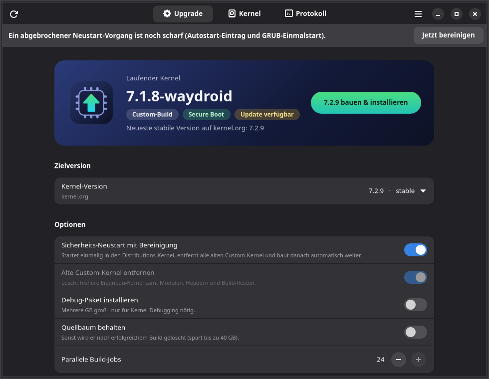

<p align="center"></p>

# Kernel Upgrade (v4.4)

[🇺🇸 Switch to English version](README.md)

Ein vollautomatisches Bash-Skript mit grafischer Oberfläche zum Kompilieren, Installieren und Signieren eines aktuellen Mainline-Linux-Kernels. Es integriert die für Waydroid nötigen Kernel-Features, entfernt alte Kernel-Reste und kümmert sich um die UEFI-Secure-Boot-Signierung.



## 🚀 Features

- **🖥️ Grafische Oberfläche (`kernel_upgrade_gui`):** GTK4/libadwaita-App mit Versionsauswahl von kernel.org, Systemstatus (Secure Boot, MOK, Autosign), Kernel-Verwaltung und Live-Protokoll samt Fortschritt. Passwortabfragen (sudo, MOK) erscheinen direkt in der App.

- **🌐 OTA Auto-Updater:** Prüft bei jedem Start das GitHub-Repository. Eine neuere Version wird heruntergeladen, auf Gültigkeit geprüft, atomar ausgetauscht und dein Befehl ohne Unterbrechung fortgesetzt. Es wird nie auf eine ältere Version zurückgestuft.

- **📦 Systemweite Integration (`--install-system`):** Installiert Skript und GUI nach `~/.scripts`, trägt den Pfad in `~/.bashrc` ein, legt einen Eintrag im Anwendungsmenü samt Icon an und aktiviert die Tab-Vervollständigung.

- **Vollautomatisch:** Lädt den gewünschten Kernel von `kernel.org` (stable, longterm, mainline oder feste Version), prüft die SHA256-Prüfsumme, konfiguriert, baut und installiert ihn.

- **Waydroid Ready:** Integriert automatisch ein `.config`-Fragment für **Binder/BinderFS** und **NTSYNC**. Ein eigenes Fragment kann unter `~/.config/kernel_upgrade/config-fragment` abgelegt werden.

- **Secure Boot & DKMS Support:** Automatisierte MOK-Generierung (Machine Owner Key), Registrierungsprüfung und Signierung der Kernel-Images (`sbsign`). Die Schlüssel liegen als PEM und DER unter `/var/lib/shim-signed/mok/`, sodass auch DKMS-Module (z. B. DisplayLink `evdi`) signiert werden.

- **🔄 Intelligente Versionsprüfung:** Erkennt, ob der Ziel-Kernel bereits läuft oder installiert ist, und schlägt Alternativen vor. Bereits gebaute Pakete werden wiederverwendet statt neu kompiliert.

- **🧹 Saubere Bereinigung (`--purge-custom`, `--cleanup`):** Eigene Kernel werden zuverlässig am Paket-Ursprung erkannt, nicht am Namen. Entfernt werden Pakete, Module, Header, Debug-Symbole, verwaiste Verzeichnisse und alte Build-Reste. Distributions-Kernel werden nie angefasst.

- **🔁 Sicherheits-Neustart:** Läuft ein Custom-Kernel, startet das System einmalig per `grub-reboot` in den Distributions-Kernel, bereinigt und setzt den Build nach dem Login automatisch fort (im Terminal oder in der GUI). Ein Abbruch im Countdown nimmt alles wieder zurück. Mit `--no-reboot` lässt sich der Neustart überspringen.

- **Autosign-Integration:** Installiert einen Post-Install-Hook, der zukünftige Kernel automatisch signiert.

- **Mehrsprachig:** Erkennt automatisch die Systemsprache (Deutsch/Englisch).

## 🛠 Voraussetzungen

- Ein Debian-basiertes System (Ubuntu, Linux Mint, Debian, …) mit GRUB
- Internetverbindung und Root-Rechte (via `sudo`) – das Skript selbst **nicht** mit `sudo` starten
- Rund 45 GB freier Speicher für den Build
- Für die GUI: GTK 4 und libadwaita ≥ 1.5 (Ubuntu 24.04, Linux Mint 22, Debian 13 oder neuer)

Build-Abhängigkeiten installiert das Skript automatisch via `apt`.

## 📦 Installation & Nutzung

```bash
git clone -b waydroid https://github.com/SoulInfernoDE/compile-kernel-from-source.git
```

```bash
cd compile-kernel-from-source && chmod +x kernel_upgrade kernel_upgrade_gui && ./kernel_upgrade --install-system && source ~/.bashrc
```

Danach steht `kernel_upgrade` in jedem Terminal samt Autovervollständigung bereit, und die GUI findest du als **Kernel Upgrade** im Anwendungsmenü.

## ⚙️ Parameter & Optionen

```
Bauen
--kernelversion VER     Version erzwingen (z. B. 6.12.1) oder Kanal: stable | longterm | mainline
--jobs N                Anzahl paralleler Build-Jobs (Standard: alle Kerne)
--no-reboot             Kein Sicherheits-Neustart; baut im laufenden Custom-Kernel
--purge-custom          Löscht alte Custom-Kernel samt Resten
--with-dbg              Installiert zusätzlich das (große) Debug-Paket
--keep-source           Quellbaum nach erfolgreichem Build behalten
-y, --yes               Alle Rückfragen mit dem Standard beantworten
--no-autosign           Autosign-Hook nicht installieren
--dry-run               Zeigt nur, was passieren würde

Verwalten
--list                  Installierte Kernel und verfügbare Versionen anzeigen
--remove VER            Einen einzelnen Custom-Kernel entfernen
--cleanup               Nur bereinigen, kein Build
--signonly [VER]        Nur einen vorhandenen Kernel in /boot signieren
--installautosign       Installiert/aktualisiert den Autosign-Hook
--uninstallautosign     Entfernt den Autosign-Hook und optional die Schlüssel
--install-system        Installiert Skript, GUI und Icon
--update / --no-update  Nur nach Update suchen / Update-Prüfung überspringen
--version, -h, --help   Version bzw. Hilfe anzeigen
```

Umgebungsvariablen: `KU_BUILD_DIR` (Build-Verzeichnis), `KU_LOCALVERSION` (Suffix, Standard `-waydroid`), `KU_NO_UPDATE=1`, `KU_NET_WAIT` (Wartezeit auf das Netzwerk in Sekunden, Standard 60).

## 🔐 Secure Boot Hinweis

Beim ersten Durchlauf erzeugt das Skript auf Wunsch neue MOK-Schlüssel und fragt nach einem Einmal-Passwort.

1. Starte das System nach Abschluss des Skripts neu.
2. Wähle im blauen MOK-Manager: Enroll MOK → Continue → Yes → Passwort eingeben → Reboot.

Der neue Kernel kann nun sicher gebootet werden.

## 📂 Dateistruktur

| Pfad | Zweck |
| --- | --- |
| `~/.scripts/` | Installationsort von `kernel_upgrade` und `kernel_upgrade_gui` |
| `~/Downloads/kernel_upgrade_build/` | Build-Verzeichnis: Quellen, Build-Log und fertige `.deb`-Pakete |
| `~/.mok_keys/` | Deine privaten UEFI-Schlüssel (PEM und DER) |
| `/var/lib/shim-signed/mok/` | System-Pfad der Schlüssel für `sbsign`, `dkms` und `kmodsign` |
| `/etc/kernel/postinst.d/sign_kernel_images` | Autosign-Hook |
| `~/.config/kernel_upgrade/config-fragment` | Optionales eigenes Konfigurations-Fragment |
